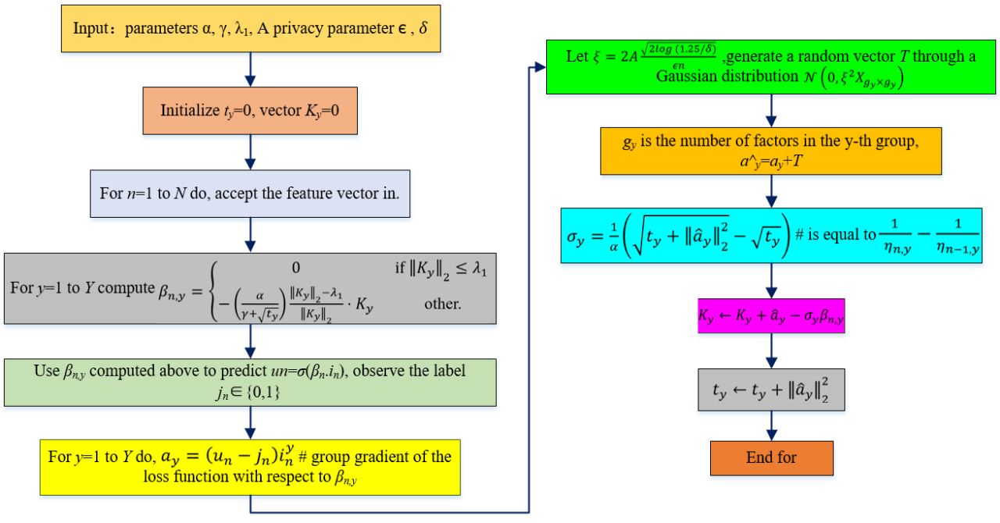

# This is the flow chart of DP-GFTPRL algorithm 


## Overview of the code
The code is written in PyTorch. 
* `main.py` contains the training and evaluation steps for three datasets: `MNIST`, `CIFAR10`, and `EMNIST (byMerge)`.
* `optimizers.py` contains the DP-GFTPRL optimizer, and `ftrl_noise.py` contains the tree-aggregation protocol, which
   is the core of the optimizer. 
* `privacy.py` contains the privacy accounting function

# This is an example for creating a virtual environment. 
sudo apt install python3-dev python3-virtualenv python3-tk imagemagick
virtualenv -p python3.7 --system-site-packages env3
. env3/bin/activate

# Install the packages.
pip install -r requirements.txt
```

Then, we set up a path where the data will be downloaded.
```bash
export ML_DATA="path to where you want the datasets saved"  # set a path to store data
```

Now we can run the code to do DP-GFTPRL training. 
For example, the following command trains a small CNN for `CIFAR-10` 
with DP-GFTPRL noise `46.3`, batch size `500` for `100` epochs (restarting every
`20` epochs). 
```bash
run=1
CUDA_VISIBLE_DEVICES=0 PYTHONHASHSEED=$(($run - 1)) python main.py \
    --data=cifar10 --run=$run --dp_gftprl=true \
    --epochs=100 --batch_size=500 --noise_multiplier=46.3 \
    --restart=20 --effi_noise=True --tree_completion=True \
    --learning_rate=50 --momentum=0.9
```
The results will be written as a
tensorboard file in the current folder (can be configured with flag `dir`).
You can view it with tensorboard
```bash
tensorboard --port 6006 --logdir .
```

To get the privacy guarantee, please refer to the
function `compute_epsilon_tree` in `privacy.py`. There is an
example in the `main` of `privacy.py` for how to use it.

